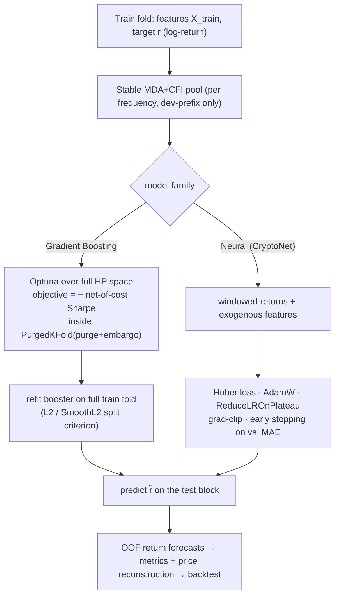
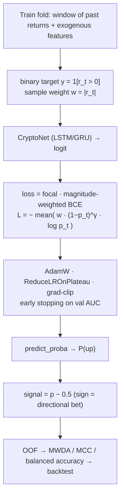

# The Forecasting Pipeline — A Detailed Technical Description

*Companion document to the report `mmda_btc_report.ipynb` (course: Modern Methods of Data
Analysis).* This document specifies, in full, **what is learned, how, and why**, how the
**profit-and-loss (PnL)** of each model is computed, the **training schemes** for the
regression and classification models, and the **empirical results** together with their
causal interpretation.

---

## 1. What is learned (task definition)

For every sampling frequency (daily, hourly, 5-minute) the models perform **one-step-ahead
forecasting of the logarithmic return**

$$r_t \;=\; \ln(P_t) - \ln(P_{t-1}),$$

where $P_t$ is the BTC close at bar $t$. For a horizon $h>1$ the target is the **cumulative
forward return** $R_t^{(h)} = \ln(P_{t+h-1}) - \ln(P_{t-1}) = r_t + \dots + r_{t+h-1}$
(implemented in `forward_log_return`; for $h=1$ this is exactly `log(P).diff()`). The price
is reconstructed from a forecast as

$$\hat P_t \;=\; P_{t-1}\,\exp(\hat r_t).$$

**Why returns and not the price level.** Modelling the level has three pathologies that
break a fair tree-vs-network comparison:

1. **Trees cannot extrapolate a trend** — a decision tree predicts a piecewise-constant
   function bounded by the training range, so on a rising price it systematically
   under-predicts; a recurrent network has no such ceiling. Comparing them on the level
   measures extrapolation ability, not predictive skill.
2. **SMAPE degenerates** toward a persistence (last-value) forecast on a near-unit-root
   level series.
3. **MASE is inflated** whenever the price regime shifts between train and test.

The log-return is (approximately) stationary, so both model families are compared on equal
footing; the price is recovered analytically for the economic backtest.

---

## 2. Data and features

Three frozen datasets (`new_day_df.csv`, `new_hour_df.csv`, `new_5min_df.csv`) are produced
once by `get_data.py` (Yahoo Finance, FRED, Binance, on-chain and sentiment sources) and
consumed offline. The predictor pool per frequency combines:

- **return-based momentum / volatility:** `ret_lag1..10`, `ret_mean5/10/20`, `ret_std5/10/20`;
- **technical indicators:** SMA ratios, EMA cross, RSI, normalised MACD, ATR %, OBV change;
- **risk / sentiment:** Fear-&-Greed level and change, VIX;
- **exogenous assets / indices:** other crypto assets, equities, ETFs, commodities;
- **calendar / time-of-day:** cyclical $\sin/\cos$ of time-of-day, hour, day-of-week, month.

All predictors are restricted to information available at the forecast time (Section 3).

---

## 3. Anti-leakage design

Look-ahead leakage is the dominant failure mode in financial ML; it is controlled at three
levels.

1. **Exogenous series are lagged after all merges** (`lag_exogenous` in `get_data.py`),
   respecting the publication lag of macroeconomic (FRED) series. BTC-derived predictors and
   all `ret_*` features are strictly lagged in `prep_returns`. Deterministic calendar /
   time-of-day features are **not** lagged (they are known in advance).
2. **The forward target does not overlap the features.** The label at $t$ uses returns
   $\ge t$; predictors use information $\le t-1$. For $h>1$ the last $h-1$ training rows are
   dropped so the training labels never overlap the test block.
3. **Every fitted transformation is fitted on training data only**, re-estimated inside each
   fold: feature selection, median imputation, 1st/99th-percentile winsorisation, and robust
   scaling.

---

## 4. Evaluation protocol: walk-forward with purging and embargo

Models are evaluated by **walk-forward validation** with rolling windows and a per-frequency
retuning cadence:

| Frequency | Train window | Test block | ≈ Folds | Retune every |
|---|---|---|---|---|
| daily | 365 bars (~1 y) | 21 (~1 mo) | ~108 | 5 folds |
| hourly | 504 bars (~3 wk) | 48 (~2 d) | ~424 | 20 folds |
| 5-minute | 1440 bars (~5 d) | 288 (~1 d) | ~52 | 5 folds |

For each fold the model trains on the train window and predicts the next (unseen) test block;
the window then rolls forward. Out-of-fold (OOF) predictions are concatenated into a single
causal series used for metrics and the backtest.

- **Hyperparameter tuning is nested inside a `PurgedKFold`** on the train fold — overlapping
  labels are purged and an **embargo** of $\max(h,\,1\%\cdot|\text{train}|)$ bars is removed
  around each validation block, so the inner search cannot peek across the label horizon.
- To limit cost, Optuna re-runs only every `retune_every` folds; between retunes the cached
  hyperparameters are reused and the model is merely refit on the new window.
- In addition to the single causal path, **combinatorial purged cross-validation (CPCV)**
  produces a *distribution* of out-of-sample metrics, which feeds the overfitting controls
  (Section 11).
- Per-fold reproducibility: each fold uses a distinct seed (`seed + fold_idx`), and a fresh
  model and scalers are instantiated per fold.

---

## 5. Feature selection (two levels)

**Level 1 — cross-fold stable selection (per frequency, leakage-safe).** Before the
walk-forward loop, `select_stable_features` ranks the candidate pool by the **median
permutation importance (mean decrease in accuracy, MDA)** across the development-prefix folds
(the first 60% of folds only — the later test folds are never seen). For each fold it fits a
`HistGradientBoostingRegressor` on the first 70% of the fold and measures the drop in $R^2$
when each feature is permuted on the held-out 30%. Collinear features ($|\rho|>0.9$) are then
clustered (union-find) and only the highest-median-importance member of each cluster is kept
(**clustered feature importance**, mitigating the substitution effect). The result is a fixed
pool of ≈20 features per frequency.

**Level 2 — per-fold top-k.** Inside `run_walk_forward` a fast per-fold top-$k$ guard runs on
the train fold only; because Level 1 already fixes a ≈20-feature pool and $k$ equals the pool
size, this is effectively pass-through in the current configuration.

**Why MDA + clustering** rather than raw Pearson: Pearson captures only linear, pairwise
association and is blind to nonlinearities and interactions; permutation importance is
model-agnostic, measured out of sample, and reflects a feature's marginal contribution given
all others. The median across folds suppresses regime-specific flukes on non-stationary data.

---

## 6. Models

All models below are trained under the **identical** walk-forward protocol of Section 4.

### 6.1 Baselines

| Baseline | Forecast rule | Purpose |
|---|---|---|
| Zero return | $\hat r_t = 0$ | random-walk-in-price benchmark |
| Last return | $\hat r_t = r_{t-1}$ | return persistence / momentum |
| Moving average | mean of past returns | smoothed persistence |
| Always long | $\hat r_t = +\varepsilon$ | directional-accuracy = base-rate-up |
| Base rate | sign of the majority class on train | the correct DA reference $\max(p,1-p)$ |

The always-long and base-rate baselines reveal whether a model beats a *trivial* bet, which
raw directional accuracy against 0.5 does not.

### 6.2 Gradient boosting — regression (LightGBM, XGBoost, CatBoost)

Gradient boosting builds an additive ensemble of shallow regression trees, each fitted to the
(pseudo-)residuals of the current ensemble: $F_m(x) = F_{m-1}(x) + \nu\, h_m(x)$, with
learning rate $\nu$ and tree $h_m$. The model maps the selected feature vector at $t$ to the
predicted return $\hat r_t$, minimising squared error.

**Per-fold tuning (the key design choice).** On each retune fold an Optuna study
(`_gb_objective`) searches the **full structural hyperparameter space supported by each
booster** — learning rate, number of trees, depth/`num_leaves`, row subsampling, column
subsampling, and L2 regularisation — selected by membership in `get_params()` (not `hasattr`,
which silently skipped CatBoost). Crucially, the **objective is the net-of-cost Sharpe ratio
in return space**, not RMSE:

```text
for each PurgedKFold split (purge + embargo) on the train fold:
    fit booster, predict r̂ on the inner validation block
    side = sign(r̂);  Sharpe = net_cost_sharpe(side, r_true, fee = 0.0014)
objective = − mean(Sharpe over inner folds)        # minimised
```

**Why optimise Sharpe and not error.** Squared error rewards predicting the magnitude of
returns; on a near-zero-mean, low-signal series its optimum is "predict ≈ 0", which yields no
tradable signal. Optimising a cost-aware Sharpe aligns hyperparameter selection with the
quantity the project actually cares about — risk-adjusted, post-cost directional value.

### 6.3 Neural networks — the `CryptoNet` architecture

`CryptoNet` is a **two-branch network** shared by both the regression and the classification
variants:

- a **recurrent branch** (LSTM *or* GRU) over a window of the last $W$ returns
  ($x_{\text{seq}} \in \mathbb{R}^{W\times 1}$), taking the last hidden state plus dropout;
- a **feed-forward branch** over the selected exogenous features at the forecast time
  ($x_{\text{ex}}$), as stacked Linear→ReLU→Dropout blocks;
- the two branches are **concatenated** and passed through a linear head to a single scalar.

Per-frequency look-back windows: daily $W=24$, hourly $W=24$ (optionally 48), 5-minute
$W=24$. Architectural hyperparameters (hidden sizes, dropout, number of exogenous layers) and
the optimiser learning rate / weight decay are chosen per architecture and frequency by a
small Optuna search.

### 6.4 Regression NN — training scheme

The regression head outputs $\hat r_t$ directly and is trained with the **Huber (SmoothL1)
loss**, optimiser **AdamW** (with weight decay), **`ReduceLROnPlateau`** scheduling,
**gradient-norm clipping** (max-norm 1.0, to stabilise the RNN), and **validation-based early
stopping** on validation MAE. The early-stopping validation slice and the Optuna-validation
slice are kept disjoint (`train / es-val / optuna-val`) so hyperparameter selection does not
overfit the same tail used for early stopping.

**Why Huber, not SMAPE/MSE.** On a return target centred near zero, the SMAPE denominator
$|y|+|\hat y|$ degenerates and the loss is dominated by tiny noise returns, collapsing the
model toward a constant ≈0 prediction (this produced the earlier sub-0.5 directional
accuracy at hourly frequency). Huber is robust to the heavy tails of crypto returns and
well-behaved at zero; the boosters minimise L2 for the same comparison.

### 6.5 Classification NN — training scheme

The classifier targets the **sign** of the next return, $y_t = \mathbf{1}[r_t>0]$, and is
trained with a **focal, magnitude-weighted binary cross-entropy** (`focal_mw_bce`):

$$\mathcal{L} \;=\; -\,\frac{1}{N}\sum_t w_t\,(1-p_t)^{\gamma}\,\log p_t,$$

where $p_t$ is the predicted probability of the realised class, $w_t \propto |r_t|$ is a
per-sample weight normalised to the train mean plus a small floor, and $\gamma$ (default 2)
is the focal focusing parameter; $\gamma=0$ recovers ordinary weighted BCE. Early stopping
and scheduling use validation **AUC** (maximised).

**Why a separate classifier and this loss.** Regression minimises a magnitude error whose
optimum on an unpredictable series is ≈0 (directional accuracy ≈ 0.5); posing the task
directly as sign classification aligns training with the directional objective. The magnitude
weight $w_t=|r_t|$ makes large bars matter more (they drive PnL), and the focal factor
$(1-p_t)^\gamma$ down-weights easy, confidently-correct bars and focuses learning on hard
reversal bars. At inference, `predict_proba` returns $P(\text{up})$ and the signal fed to the
OOF pipeline is the pseudo-return $p-0.5$ (its sign is the directional bet).

---

## 7. From forecast to position — two-stage meta-labeling

Following López de Prado (*Advances in Financial Machine Learning*, ch. 3), the trade is
decomposed:

- **Stage 1** (sequence NN) sets the **side** $\mathrm{sign}(\hat r)$;
- **Stage 2** (gradient-boosting classifier) estimates the **confidence**
  $p_{\text{ok}}=P(\text{the bet is correct})$, used to size and filter trades.

Stage 2 is trained **strictly on the out-of-fold predictions of Stage 1** with its own causal
walk-forward (purge/embargo = $h$). A **sanity gate** first checks the out-of-sample rank IC
of a regressor on the residual $e=r-\hat r$; if it is ≈0, no exploitable structure remains and
the second stage is not expected to help. The continuous size produced here can be passed to
the backtest (Section 8).

---

## 8. How model PnL is computed (the backtest)

The backtest (`backtest.py`) converts the OOF **reconstructed-price** series
$\hat P_t = P_{t-1}\exp(\hat r_t)$ into a trading signal and a PnL path. Two modes exist.

### 8.1 Binary long/flat (default)

At each bar the implied forecast return relative to the last *actual* price is
$\hat r_t = \hat P_t / P_{t-1} - 1$. A stateful rule with hysteresis and a minimum holding
period governs the position:

- enter long when $\hat r_t > \texttt{enter\_threshold}$;
- exit to flat when $\hat r_t < \texttt{exit\_threshold}$ after at least `min_hold` bars.

While long, $\text{PnL}_t = P_t - P_{t-1}$ (one BTC unit). Every position change incurs costs
on the notional $P_{t-1}$:

$$\text{cost} \;=\; P_{t-1}\,(2\,\texttt{fee\_rate} + 2\,\texttt{slippage}),$$

i.e. both legs (entry and exit) are charged at the trade. With `fee_rate = 0.05%` and
`slippage = 2 bps`, the **round-trip cost is $2(0.0005)+2(0.0002)=0.14\%$** — the natural
minimum threshold below which a trade cannot pay for itself.

### 8.2 Continuous sizing

The target position is taken from a size column (e.g. the meta-labeling size),
$\text{pos}_t = \mathrm{clip}(\text{size}_t,\,-cap,\,cap)$ (shorts allowed). Then
$\text{PnL}_t = \text{pos}_t\,(P_t - P_{t-1})$, and costs are charged on the change of
notional $P_{t-1}\,|\Delta\text{pos}_t|$ (one side per rebalance).

### 8.3 Returns, risk, and the benchmark

Net PnL is $\text{PnL}_t - \text{fees}_t$, and the **percentage return** is
$\text{ret}_t = \text{netPnL}_t / P_{t-1}$. Working in percentage returns (not USD PnL) is
scale-invariant, so high-price segments of the series do not artificially dominate the risk
estimate. The reported statistics are the annualised **Sharpe**
($\sqrt{\text{periods/yr}}\cdot \overline{\text{ret}}/\sigma_{\text{ret}}$), **Sortino**
(downside-only $\sigma$), **Calmar** (annualised return / max drawdown), **PSR**, the maximum
drawdown in USD, and turnover. **Buy-and-Hold** (hold 1 BTC over the same window) is the
passive benchmark, evaluated period-by-period on the same timestamps.

> Annualisation via $\sqrt{\text{periods/yr}}$ assumes IID returns; on autocorrelated,
> heavy-tailed intraday data this *overstates* the Sharpe, so statistical inference relies on
> PSR/DSR rather than the raw Sharpe.

### 8.4 Honest threshold selection

To avoid tuning the entry threshold on the test period, `select_threshold_by_sharpe` chooses
the threshold by net-of-cost Sharpe on the **chronologically first 40% of the OOF** and
applies it to the remaining 60% — so the reported "val-tuned" performance contains no
look-ahead.

---

## 9. Evaluation metrics

| Metric | Definition | Role |
|---|---|---|
| **Rank IC** | Spearman $\rho(\hat r, r)$ on a fold | monotone forecast–outcome association |
| **IC IR** | $\overline{\text{IC}}/\sigma_{\text{IC}}$ across folds | *stability* of the signal (lead criterion) |
| **MWDA** | $\sum |r_t|\,\mathbf{1}[\mathrm{sign}\,\hat r_t=\mathrm{sign}\,r_t]/\sum|r_t|$ | magnitude-weighted hit rate (∝ PnL) |
| **Net-cost Sharpe** | $\sqrt{\text{ann}}\cdot\overline{R}/\sigma_R$, $R_t=\text{side}_t r_t-\text{fee}\,|\Delta\text{side}_t|$ | risk-adjusted post-cost value |
| **MASE** | model MAE / naive MAE | scaled point accuracy vs naive |
| **MCC**, **balanced accuracy** | confusion-matrix correlation / mean recall | sign-classifier quality under imbalance |
| **PSR** | $\Phi$ of skew/kurtosis-adjusted Sharpe $z$-score | probability true Sharpe > 0 |
| **DSR** | PSR with the threshold set to the expected max Sharpe over $N$ trials | multiple-testing-deflated significance |
| **PBO** | CSCV fraction of splits where the IS-best config ranks below the OOS median | probability the leader is overfit |

Directional accuracy is reported but is **not** a selection criterion: it ignores magnitude
and is implicitly benchmarked against an incorrect 0.5 instead of the base rate.

---

## 10. Model selection (composite)

One winner per family per frequency is chosen by a lexicographic composite —
**IC IR → net-of-cost Sharpe → MWDA**, with **MASE** as a tie-breaker. IC IR leads because a
small but *stable* information coefficient is commercially more valuable than a large but
erratic one; the net-of-cost Sharpe ensures the choice survives transaction costs.

---

## 11. Overfitting control

Because ≈7 models × 3 frequencies × many folds are screened, the apparent best result is
subject to selection bias. Two non-parametric controls guard against it, computed over CPCV
paths:

- **Deflated Sharpe Ratio (DSR):** PSR with the benchmark set to the expected maximum Sharpe
  under $N$ independent trials; it deflates the observed Sharpe for the number of
  configurations tried and for non-normal returns.
- **Probability of Backtest Overfitting (PBO):** via combinatorially-symmetric
  cross-validation — the fraction of in-sample/out-of-sample splits in which the in-sample
  best configuration falls below the out-of-sample median.

**Decision rule:** a configuration is **not deployable if DSR < 0.95 or PBO > 0.5**,
irrespective of its single-path Sharpe.

---

## 12. Results and causal interpretation

The walk-forward run completed over all three frequencies (≈108 / 424 / 52 folds).

**Statistical skill.** Rank IC is positive everywhere (≈0.15–0.20 at 5-minute, ≈0.16 daily,
≈0.09 hourly). The trivial **last-return** predictor attains the **highest IC IR at every
frequency** (4.12 at 5-minute, 0.97 daily, 0.96 hourly). *Causally, this means the
predictability is mostly return persistence (momentum/autocorrelation), not a signal unique
to the learned models;* the GRU reproduces the same signal with markedly lower turnover.

**Economics (net of the 0.14% round-trip cost).** Net-of-cost Sharpe is **positive only at
the daily horizon and only for the neural models** (GRU +0.11, LSTM-clf +0.07; gradient
boosting ≈0). At hourly and 5-minute it is negative for *every* model (−0.08…−0.27 hourly;
−0.4…−0.6 at 5-minute). In the daily backtest the GRU cost-aware strategy returns $168k at
Sharpe **1.64** versus Buy-and-Hold $53k at 0.63, with one-third the drawdown; under the
**honest val-tuned threshold** the daily GRU reaches **Sharpe 0.89 vs 0.41** for B&H with only
176 trades. Continuous meta-sizing matches that Sharpe with a far smaller drawdown
(Calmar ≈1.7, PSR ≈1.0). *Causally, the high-frequency edge is real statistically but is
destroyed by turnover × cost:* the zero-threshold variant at 5-minute reaches Sharpe −124…−176.

**Overfitting controls.** DSR/PBO pass only at the daily horizon; at **5-minute PBO = 0.6 > 0.5**
and DSR ≈ 0, so the high 5-minute IC IR is flagged as a **multiple-testing artefact**, not an
exploitable edge. This is the textbook separation of *statistical predictability* from
*economic tradability*.

**Meta-labeling.** The residual rank IC after Stage 1 is ≈0 (daily 0.05, 5-minute −0.005), so
the Stage-2 confidence filter does **not** improve net-of-cost Sharpe — the primary model
already captures most of the limited structure.

**Architecture comparison.** Neural models (the GRU in particular) dominate gradient boosting
on this task: the best gradient-boosting Sharpe is ≈0.12 at daily and negative at higher
frequencies. During sharp moves ($|r|>2\sigma$) all models under-predict the magnitude (MASE
3–4), but the daily GRU recovers the *direction* of such moves in ≈2/3 of cases.

**Overall conclusion.** Once leakage was removed and an economically meaningful selection
criterion adopted, the only robust, tradable configuration is a **daily GRU return model with
cost-aware sizing**; at higher frequencies no architecture shows a stable directional edge net
of costs — consistent with weak-form efficiency at those horizons.

---

## 13. Training-scheme diagrams

### 13.1 Regression (gradient boosting and `CryptoNet` regressor)



### 13.2 Classification (`CryptoNet` sign classifier)



---

## 14. Limitations and threats to validity

- **Cost sensitivity dominates intraday results.** A fixed 0.14% round-trip is conservative
  but central; the hourly/5-minute conclusions are a statement about tradability under that
  cost, not about the absence of any statistical signal.
- **Sharpe annualisation assumes IID returns**, which intraday crypto data violate; PSR/DSR
  are the primary inferential statistics.
- **The daily result rests on ≈108 folds** and a signal that overlaps strongly with a trivial
  momentum baseline; the GRU's value-add is lower turnover and better cost-adjusted
  performance rather than a fundamentally different signal.
- **DSR/PBO are currently computed over the gradient-boosting family**; extending them to the
  neural winner would strengthen the significance statement for the daily GRU.
- **Overlapping positions at $h>1$** are only approximately handled (via `min_hold ≥ h`).
