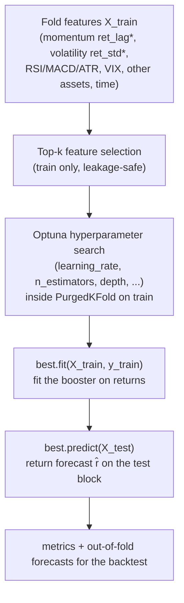
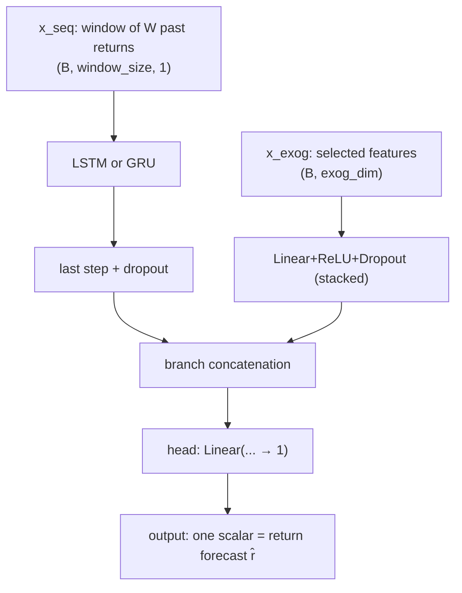
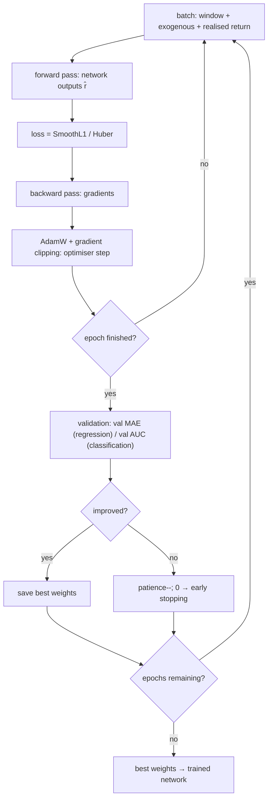
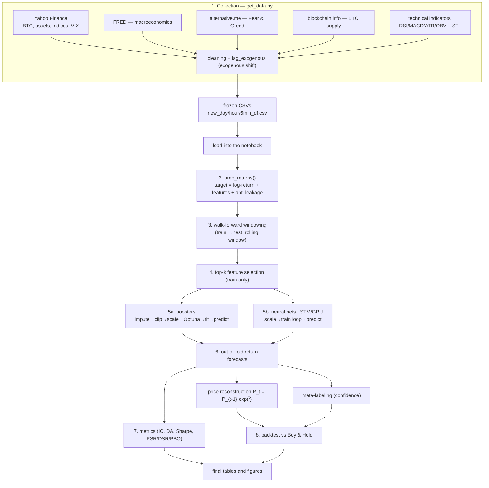

# Implementation Notes and Repository Guide

This appendix documents the software that accompanies the study. The project forecasts
Bitcoin logarithmic returns from heterogeneous predictors (price, other assets,
macroeconomic series, technical indicators) and compares classical, linear, tree-based
(gradient-boosting), and neural models under a common evaluation protocol.

**Entry point.** The notebook `mmda_btc_report.ipynb` reads the frozen CSV snapshots and
executes the entire pipeline without network access; all logic resides in `.py` modules.

**Target.** The models predict the next-bar logarithmic return `r = ln(P_t / P_{t-1})`
(a value near zero), not the price level. The price is reconstructed as
`P_t = P_{t-1} · exp(r̂)`.

---

## 1. Repository Map

Principal call chain:
`mmda_btc_report.ipynb` → `walk_forward.py` → (`ml_models.py`, `validation.py`, `metrics.py`),
together with `backtest.py`, `meta_labeling.py`, `free_features.py`, and `parallel_run.py`.

| File / directory | Role | Category |
|---|---|---|
| `mmda_btc_report.ipynb` | Main report; runs the full pipeline on the frozen CSVs | orchestration (entry point) |
| `walk_forward.py` | Walk-forward engine: windowing, feature selection, Optuna, training, metrics | orchestration |
| `ml_models.py` | Models: linear, ensemble, neural sequence networks (LSTM/GRU), classifiers | models |
| `validation.py` | Cross-validation for financial series (PurgedKFold, CPCV) with purge and embargo | utilities |
| `metrics.py` | Forecast and strategy metrics (IC, Sharpe, PSR, DSR, PBO) | utilities |
| `backtest.py` | Economic backtest: signal → PnL with transaction costs, Sharpe, drawdown | evaluation |
| `meta_labeling.py` | Two-stage meta-labeling: a gradient-boosting classifier estimates trade confidence | models |
| `free_features.py` | Backfillable exogenous features (Binance order-flow, funding, on-chain) | data |
| `parallel_run.py` | Process-parallel execution of independent walk-forward runs | orchestration |
| `get_data.py` | Downloads and consolidates raw data (Yahoo Finance, FRED, Binance) into CSVs | data |
| `fracdiff.py` | Fractional differencing of price (a stationary memory feature) | data |
| `tests/` | Automated `pytest` suite | infrastructure |
| `requirements.txt` | Dependency list | infrastructure |
| `new_day_df.csv`, `new_hour_df.csv`, `new_5min_df.csv` | Frozen datasets (daily / hourly / 5-minute) | artefacts |

---

## 2. Gradient-Boosting Training Schematic

The gradient-boosting models are **LightGBM, XGBoost, and CatBoost** — additive ensembles
of shallow trees, each correcting the residuals of its predecessors.



Core training step (`walk_forward.py`):
```python
best = gb_model_factory()             # instantiate LightGBM / XGBoost / CatBoost
_apply_gb_params(best, cached_params) # apply the Optuna-selected hyperparameters
best.fit(X_train, y_train)            # fit on the training fold
y_pred = best.predict(X_test)         # forecast the return on the next block
```

---

## 3. Neural Network Schematic (LSTM / GRU)

`CryptoNet` is a two-branch network: a recurrent branch over the sequence of past returns
(LSTM or GRU) and a feed-forward branch over the exogenous features; the branches are
concatenated to produce a single return forecast.

**Architecture:**


**Training loop:**


The loss is the Huber (SmoothL1) criterion, the optimiser is AdamW (learning rate selected
by Optuna and reduced on plateau), and training uses validation-based early stopping.

**Why both families.** Gradient boosting and neural networks solve the same task by
different means and are **compared head-to-head** — the core of the study — through a single
walk-forward protocol, shared metrics, and one backtest. This is not a general ensemble; the
only composition is meta-labeling, in which a gradient-boosting model scores the confidence
of the primary model's trade.

---

## 4. End-to-End Pipeline



---

## 5. Narrative Summary

A one-off script (`get_data.py`) downloads the Bitcoin price, the prices of other assets and
indices, macroeconomic series, the Fear & Greed index, and BTC supply; these are cleaned,
time-aligned, augmented with technical indicators, and saved as CSV files — a frozen snapshot
of the data. The main notebook then reads these CSVs offline, converts price to logarithmic
return, constructs dozens of features (momentum, volatility, indicators, time) and lags
anything that could peek into the future. Walk-forward validation follows: a window rolls
forward in time, the model learns from the past, forecasts the next short block, and the
window advances, repeatedly. On each window roughly twenty features are selected, Optuna
tunes hyperparameters under purged cross-validation, and both model families — boosters
(LightGBM/XGBoost/CatBoost) and neural networks (LSTM/GRU) — are trained. Their forecasts are
assembled into a single series, quality metrics are computed, and the return is converted
back into price and run through a cost-aware trading backtest benchmarked against
Buy-and-Hold. The output is the set of tables and figures that show which model forecasts
best and whether that translates into economic value.

---

## 6. Reproducibility Note

The pipeline is CPU-bound (gradient boosting and Optuna dominate); the small neural networks
use the GPU when available. Independent runs are dispatched across CPU processes
(`parallel_run.py`). When PyTorch and LightGBM are loaded in the same process they each ship
their own OpenMP runtime, which can cause a segmentation fault; the feature-selection path is
therefore LightGBM-free, GPU-bound (neural) and CPU-bound (boosting) runs are dispatched in
separate passes, and `KMP_DUPLICATE_LIB_OK=TRUE` is set in worker processes.
